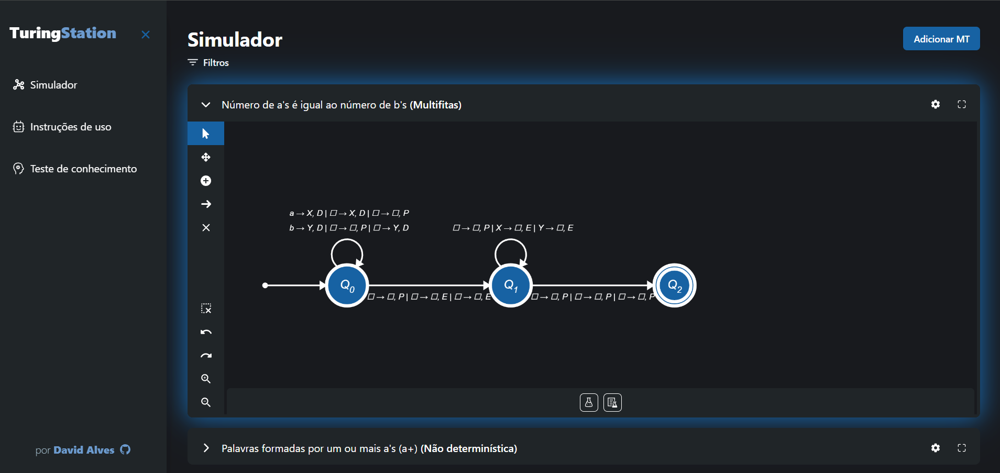
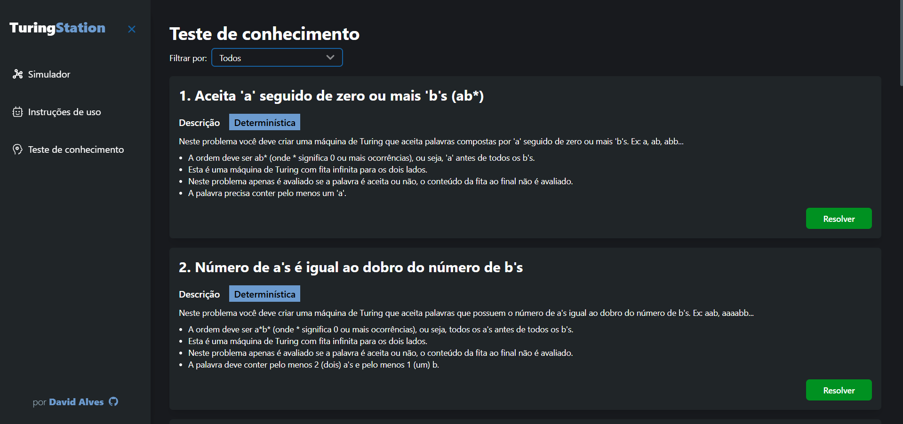
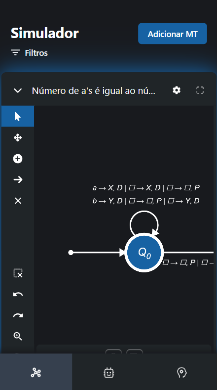
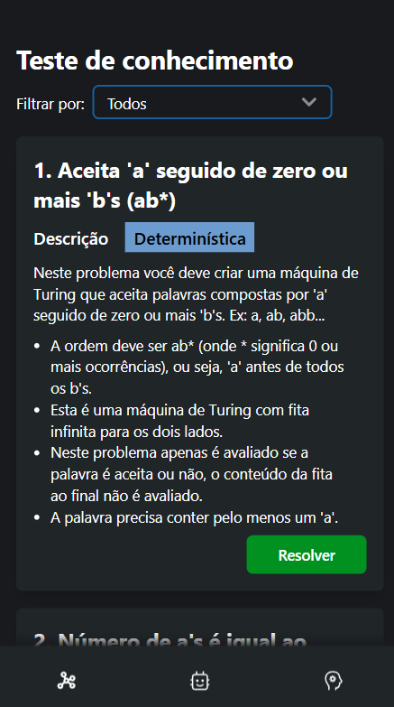

<br />
<div id="back-to-top" align="center">
  <a href="https://github.com/dev-david-alves/turing-station/">
    
  </a>

  <h3 align="center">Turing Station</h3>

  <p align="center">
    Uma plataforma Web para praticar conceitos de Máquinas de Turing
    <br />
    <a href="https://dev-david-alves.github.io/turing-station">Visualizar no Github Pages</a>
  </p>
</div>

<!-- TABLE OF CONTENTS -->
<!-- <details>
  <summary>Table of Contents</summary>
  <ol>
    <li>
      <a href="#about-the-project">About The Project</a>
      <ul>
        <li><a href="#built-with">Built With</a></li>
      </ul>
    </li>
    <li>
      <a href="#getting-started">Getting Started</a>
      <ul>
        <li><a href="#prerequisites">Prerequisites</a></li>
        <li><a href="#installation">Installation</a></li>
      </ul>
    </li>
    <li><a href="#usage">Usage</a></li>
    <li><a href="#roadmap">Roadmap</a></li>
    <li><a href="#contributing">Contributing</a></li>
    <li><a href="#license">License</a></li>
    <li><a href="#contact">Contact</a></li>
    <li><a href="#acknowledgments">Acknowledgments</a></li>
  </ol>
</details> -->

<!-- ABOUT THE PROJECT -->

## SOBRE O PROJETO



Turing Station é uma plataforma completa para você estudar e praticar os conceitos de maquinas de Turing. Aqui você pode simular diferentes variantes de forma interativa utilizando seu computador ou celular. Além disso, a plataforma conta com videoaulas e questões para resolver e praticar este assunto tão interessante.

### FEITO COM

- 
- 
- 
- 
- 
- 
- 

<!-- GETTING STARTED -->

## COMO UTILIZAR

Para utilizar o Turing Station localmente você precisa ter algumas ferramentas instaladas.

### Pré-requisitos

- node
- npm
- react

### Instalação

1. Clone este repositório
   ```sh
   git clone https://github.com/dev-david-alves/turing-station.git
   ```
2. Instale os pacotes NPM
   ```sh
   npm install
   ```
3. Na pasta do projeto, execute o seguinte comando
   ```sh
   npm run dev
   ```
4. Clique no endereço localhost disponibilizado no terminal. Exemplo:
   ```sh
   http://localhost:5100/turing-station
   ```

<!-- USAGE EXAMPLES -->

## Utilizando

Utilize o Turing Station nos mais diversos dispositivos. Crie, simule, importe e exporte máquinas de Turing.

### Tela de Simulação


### Tela de Questões



### Telas no Smartphone

<div style="display: flex; align-items: center;">





</div>

<!-- LICENSE -->

## Licença

Distribuído por meio da licença MIT. Veja `LICENSE.txt` para mais informações.

<!-- CONTACT -->

## Sobre o autor

Bacharelando em Ciência da Computação na Universidade Federal do Ceará, campus Quixadá, apaixonado por programação. Amo criar projetos interessantes e aprender coisas novas.

## Contatos

David Alves - [Linkedin](https://www.linkedin.com/in/dev-david-alves/) - david.als.soares@gmail.com

Link do Projeto: [https://github.com/dev-david-alves/turing-station/](https://github.com/dev-david-alves/turing-station/)

<!-- ABOUT -->

## Mais detalhes sobre o projeto

Este projeto foi desenvolvido para a realização da atividade de Trabalho de Conclusão de Curso na Universidade Federal do Ceará, campus Quixadá, no ano de 2024. Meu objetivo foi criar uma ferramenta que possa contribuir no ensino e aprendizado sobre o tema máquinas de Turing para os alunos da disciplina de Teoria da Computação.

##

<p align="right">(<a href="#back-to-top">Voltar ao topo</a>)</p>
